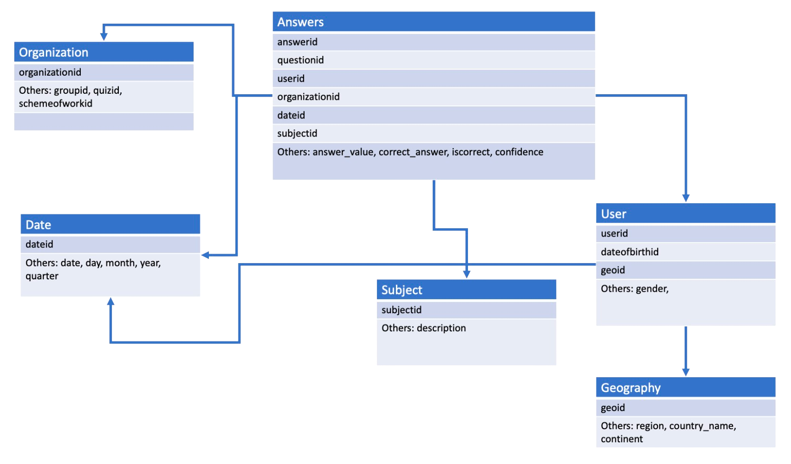

# LDS
"Decision Support System - Module II: Laboratory of Data Science" Class' Team Project - MSc in Data Science and Business Informatics @ University of Pisa

## Project

The project consists in a set of assignements corresponding to a BI process: data integration, construction of an OLAP cube, qurying of a OPLAP cube and reporting.

## Part 1: Datawarehouse building

### Introduction 
In Part 1 of the project you are required to create and populate a database starting from .csv files and perform different operations on it. In the following you can find a set of incremental assignments, each one with a brief description of what you are required to produce and what tools you can use for the task.

### Build the datawarehouse
**answers full.csv** contains the main body of data: a table with data about answers given by students to various multiple-choice questions. In the same table, there are several data regarding the questions, the students and the subject of the questions.
The file **subject metadata.csv** contains informations about the subject of each question. The subject is given by a list of integers in the main data that can be used to index the **answers full.csv** to retrieve the topic of the question.
You will have to split and integrate the main file to reproduce the schema in Figure 1.
The goal of the following assignments is to build the schema and deploy it on server lds.di.unipi.it. Beware that, just as in real-life scenario, files may contain missing values and/or useless data.

> **_Assignment 0:_** Create the database schema in Figure 1 using SQL Server Management Studio in server lds.unipi.it. The name of the database must be GroupID DB (example: Group 01 DB).

> **_Assignment 1:_** 
Write a python program that splits the content of answers full.csv into the six separate tables: answers, organization, date, subject, user and geography. You will also have to write several functions to perform integration of the main data body. In particular: 
> * You will have to generate some missing ids, like organizationid and geoid. Use the data that you have available in a suitable way to infer or generate these ids.
> * the **iscorrect** attribute is the main measure of the datawarehouse. You can compute its values by comparing the variables answer value and cor- rect answer
> * the description in the subject table should be a string describing the various topics of the question in subject level order (explore the **subject metadata.csv** to learn more about that)
> * find a way of integrating the continent into the Geography table. You can retrieve the information somewhere, or find a way of providing it yourself
> * the Data table should accommodate for both dates of birth of users and for dates of answers. You can clip dates to the day, discarding hours and minutes.
>
> All the above operations must be done WITHOUT using the pandas library.

> **_Assignment 2:_**
> Write a Python program that populates the database GroupID DB with all teh data you prepared in Assignment 1, establishing schema relations as appropriate.

Fig.1 - Database diagram

## Part 2: SSIS - Integration Service

### Introduction
In Part 2 of the project you are required to solve some problems on the database you
created in Part 1. Solve the exercises using Sequel Server Integration Services (SSIS) with
computation on client side (i.e., do not use any sql command in the nodes, only standard
SSIS nodes).

> **_Assignment 0:_** 
For every country, the number of total answers.

> **_Assignment 1:_**
> A group (identified by GroupId) is said to have an age mismatch if the difference
between the date of birth of the youngest participating student and the oldest is
greater than 365 days. List all the groups with an age mismatch.

> **_Assignment 2:_** 
For each continent the ratio between correct answers of males and correct answers
of females

## Part 3: SASS - Analysis Service

### Introduction
In Part 3 of the project you are required to answer some business questions on a datacube
that you will create on the database you prepared. Document how you build your datacube in
your report and solve the business questions using MultiDimensional eXpressions (MDX) in
SQL management studio.

> **_Assignment 0:_** 
Build a datacube from the data of the tables in your database, defining the appropriate hierarchies for time and geography. Create the needed measures based on
the queries you need to answer.

> **_Assignment 1:_**
>  Show the percentage increase or decrease in correct answers with respect to the
previous year for each student

> **_Assignment 2:_**
> For each subject show the total correct answers in percentage with respect to the
total answers of that subject.

> **_Assignment 3:_**
> Show the students having a total incorrect answers greater or equal than the average
incorrect answers in each continent.

> **_Assignment 4:_**
> Create a dashboard that shows the geographical distribution of correct answers and
incorrect answers

> **_Assignment 5:_**
> Create a plot/dashboard of your choosing, that you deem interesting w.r.t. the
data available in your cube

